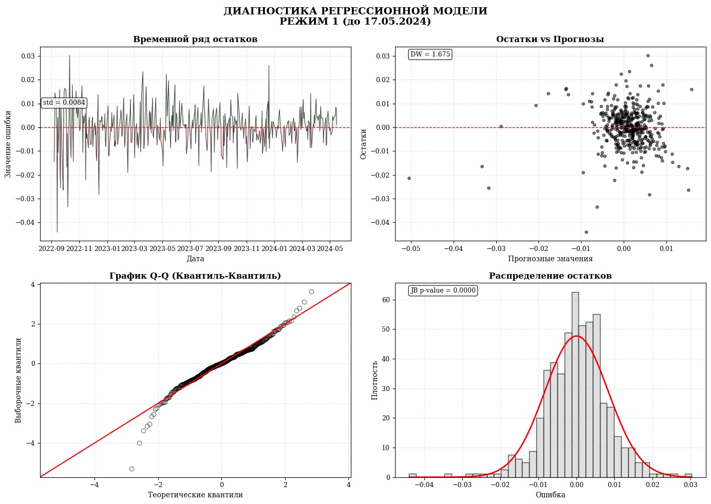
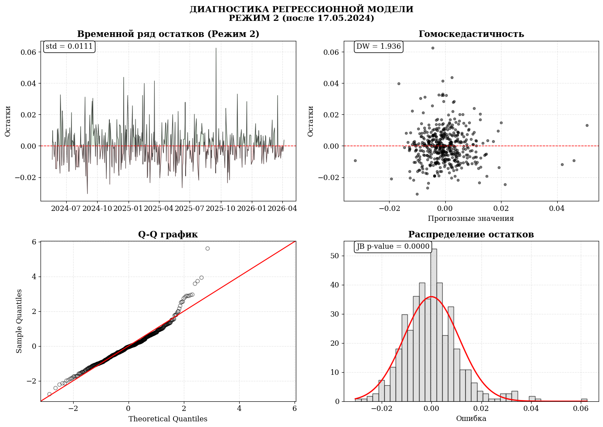
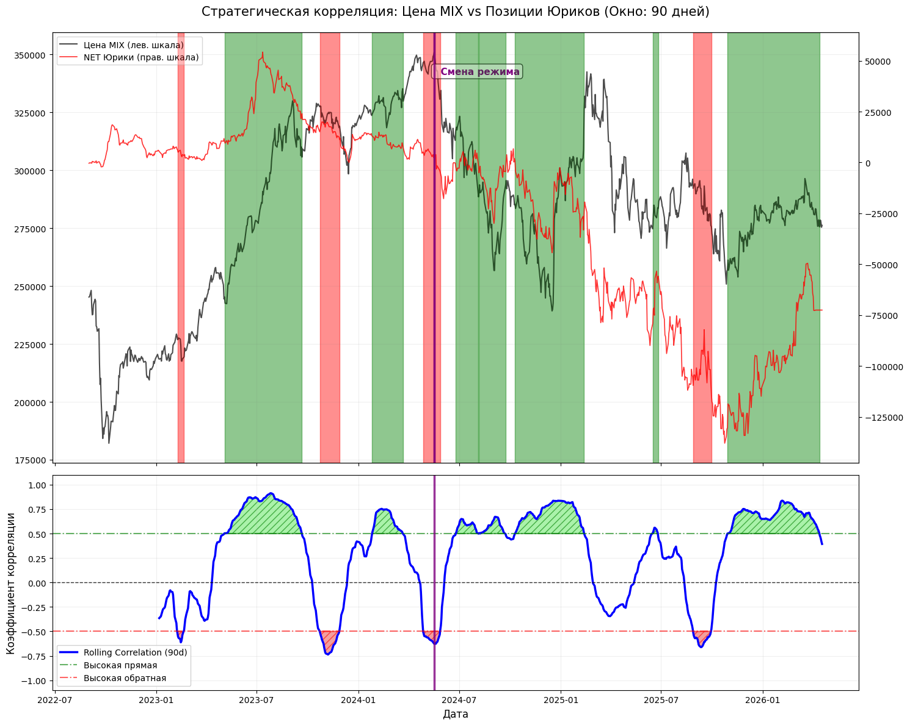
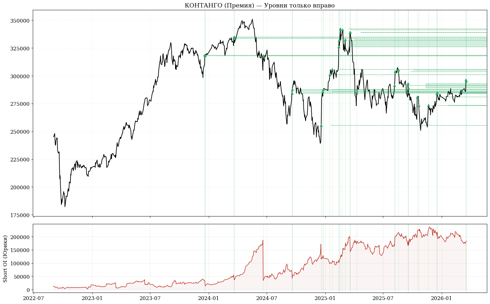
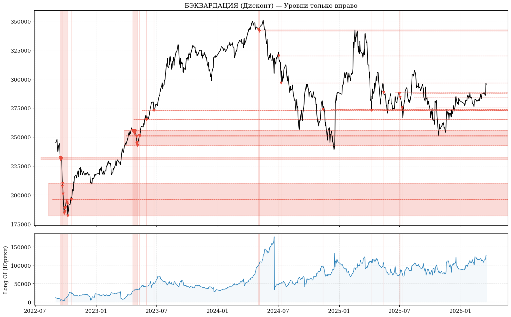

Эконометрический анализ ценообразования  фьючерса MIX (2022–2026): сдвиг режимов ДКП и институциональные потоки.


## О проекте
Фьючерс MIX — расчётный дериватив на индекс IMOEX, в цене которого заложены
ожидания крупных участников рынка. Проект разбирает, какие факторы двигают
фьючерс, как эта структура меняется между режимами денежно-кредитной
политики, и что можно увидеть в поведении открытого интереса и базиса
контракта.

## Данные
- Цены (MIX, IMOEX, USD, CNY, Brent, RVI, RGBI, S&P500, ставки RUSFAR/RUONIA) —
  вручную с Финама, период 09.2022–04.2026.
- Открытый интерес по группам участников (физические / юридические лица) —
  спарсен через API MOEX ISS (`scripts/fetch_oi.py`).

---

## 1. Два режима, две регрессии

Моделируется дневная доходность фьючерса. Период разбит по границе — смена рыночного тренда 17.05.2024.

### Режим 1 (до 17.05.2024)

| Фактор | Коэф. | p-value |
|---|---|---|
| CNY_LAG1 | 0.194 | <0.001 |
| BASIS_LAG1 | 0.001 | <0.001 |
| DIFF_RVI | -0.001 | <0.001 |
| DIFF_RGBI | 0.007 | <0.001 |
| SP500_LAG1 | 0.121 | 0.002 |

R² = 0.32. Значим широкий набор факторов — юань, базис, волатильность,
гособлигации, S&P500. Рынок в этот период реагирует на общий макро-фон и
кросс-рыночные связи.



### Режим 2 (после 17.05.2024)

| Фактор | Коэф. | p-value |
|---|---|---|
| RGBI_Ret | 1.203 | <0.001 |
| RET_LAG1 | 0.143 | 0.0005 |
| D_NET_YUR | 0.369 | 0.005 |
| D_RVI | -0.001 | 0.031 |

R² = 0.33 (устойчивые к гетероскедастичности ошибки, HC0). Значимость
смещается к рынку госдолга (RGBI) и позиционированию юридических лиц —
структура зависимости сузилась и переориентировалась на ставочные ожидания.



--- 

## 2. Скользящая корреляция: цена vs позиции юридических лиц

90-дневная скользящая корреляция между ценой MIX и чистой позицией
юридических лиц периодически уходит в сильный плюс (>0.5) и сильный
минус (<-0.5).



**Наблюдение**: на ценовом максимуме (весна 2024) корреляция уходит в
мощный отрицательный экстремум — цена растёт, а чистая позиция юрлиц
падает. Похоже, что в этой волне покупок юридические лица выступали
контрагентом и продавали в рост. На правом краю графика — обратная
картина: цена и позиции юрлиц растут синхронно, что больше похоже на
классический бычий тренд, где крупные игроки движутся вместе с рынком,
а не против него.

*Важная оговорка: это наблюдение по конкретным эпизодам, а не
статистически подтверждённая закономерность по всей выборке — для
превращения в устойчивый вывод нужно прогнать такую же проверку по всем
экстремумам корреляции за период, а не по одному-двум.*

---

## 3. Аномалии базиса: зоны премии и дисконта

Базис — отклонение фактической цены фьючерса от теоретической
(cost-of-carry). Экстремальные отклонения (>1.5σ) размечены как зоны
контанго (премия, Risk-On) и бэквордации (дисконт, Risk-Off).

Справедливая цена фьючерса рассчитывается по модели Cost-of-Carry:
F = S × (1 + (r - q) × T/365)

где:
F = теоретическая форвардная цена
S = скорректированная спот-цена (S_adj)
r = безрисковая ставка (%)
q = дивидендная доходность (%)
T = срок до экспирации (дней)




#### 1.  Идентификация аномалий через Z-Score (±1.5σ)

Abnormal_Basis = F_market - F_theory

Полученный ряд стандартизируется:

Z = (Abnormal_Basis - μ) / σ

**Интерпретация:**
- **Экстремальное контанго (Премия, Z > +1.5σ):** Перегрев фьючерса относительно спота, сопровождающийся ростом коротких позиций юрлиц.
- **Экстремальная бэквардация (Дисконт, Z < -1.5σ):** Глубокая просадка фьючерса относительно теории, коррелирующая с накоплением длинных позиций.
---

#### 2. Ключевое наблюдение (Проекция уровней)

Ценовые диапазоны, зафиксированные в моменты пробоя порогов $|Z| > 1.5$, проецируются вправо по оси времени:

* **Зоны дисконта ($Z < -1.5$):** Исторические экстремумы бэквардации впоследствии неоднократно отрабатывали как уровни **поддержки** при повторных подходах цены.
* **Зоны премии ($Z > +1.5$):** Диапазоны пикового контанго в дальнейшем выступали в роли уровней **сопротивления**.

**Наблюдение**: ценовые уровни, зафиксированные в момент экстремума
базиса, в ряде случаев дальше по времени "работали" как поддержка (для
зон дисконта) или сопротивление (для зон премии) — рынок впоследствии
возвращался к этим уровням.

*Оговорка: разметка уровней ретроспективна (сделана постфактум, когда
уже известно, куда пошла цена) — это гипотеза для дальнейшей проверки
бэктестом, а не подтверждённый торговый сигнал.*

---

##  Структура репозитория

```text
moex-futures-econometrics/
├── data/ # Данные
│ ├── market_data.xlsx # Исходные рыночные данные
│ ├── MIX_OI_daily_CORRECT.csv # Открытый интерес (парсинг MOEX)
│ ├── df_final.csv # Собранные цены
│ └── df_combined.csv # Цены + OI
│
├── scripts/ # Скрипты
│ ├── 1_fetch_oi.py # Парсинг OI с MOEX
│ ├── 2_merge_data.py # Сборка цен
│ ├── 3_combine_data.py # Объединение цен + OI
│ ├── 4_analysis_mode1.py # Регрессия Режим 1 (до 17.05.2024)
│ ├── 5_analysis_mode2.py # Регрессия Режим 2 (после 17.05.2024)
│ ├── 6_rolling_correlation.py # Скользящая корреляция цена–OI
│ └── 7_basis_analysis.py # Z-Score базиса
│
├── notebooks/ # Jupyter Notebooks
│ └── images/ # Графики
│
├── .gitignore
├── LICENSE
├── README.md
```
